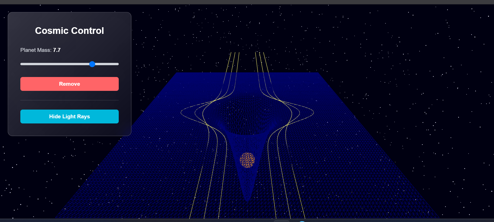

# 🌌 Interactive Spacetime Simulator

A fun, interactive 3D visualization of Einstein's theory of General Relativity, built with Next.js and React Three Fiber. This project demonstrates how massive objects curve the fabric of spacetime and how that curvature affects the path of light—a phenomenon known as gravitational lensing.




---

### ✨ Features

* **Real-time Interaction**: Adjust the planet's mass using a slider and see the effects instantly.
* **Spacetime Curvature**: The 3D grid deforms dynamically to represent the gravity well created by the planet.
* **Gravitational Lensing**: Toggleable light rays that bend realistically as they pass the massive object.
* **Smooth Animations**: Built with `react-spring` for fluid, physics-based animations.
* **Modern UI**: Sleek and simple control panel for interacting with the simulation.

---

### 🛠️ Tech Stack

* **Framework**: [Next.js](https://nextjs.org/) (v14+)
* **Language**: [TypeScript](https://www.typescriptlang.org/)
* **3D Rendering**: [React Three Fiber](https://docs.pmnd.rs/react-three-fiber/) & [React Three Drei](https://github.com/pmndrs/drei)
* **Animation**: [React Spring](https://www.react-spring.dev/)
* **Styling**: [Tailwind CSS](https://tailwindcss.com/)

---

### 🚀 Getting Started

To run this project locally, follow these simple steps.

1.  **Clone the repository:**
    ```bash
    git clone [https://github.com/HaniRawat/gWarp.git](https://github.com/HaniRawat/gWarp.git)
    cd gWarp
    ```

2.  **Install dependencies:**
    ```bash
    npm install
    # or
    yarn install
    ```

3.  **Run the development server:**
    ```bash
    npm run dev
    # or
    yarn dev
    ```
    Open [http://localhost:3000](http://localhost:3000) with your browser to see the result.

---

### 🧠 What I Learned

This project was a fantastic deep dive into the world of 3D graphics on the web. Key takeaways include:
* Bridging the gap between a standard 2D React UI and a 3D `react-three-fiber` canvas.
* Managing complex state that affects both the UI and the 3D objects.
* Implementing physics-based animations with `react-spring` and debugging subtle timing and lifecycle issues.
* Translating a complex physics concept like spacetime curvature into a tangible, interactive visual experience.
